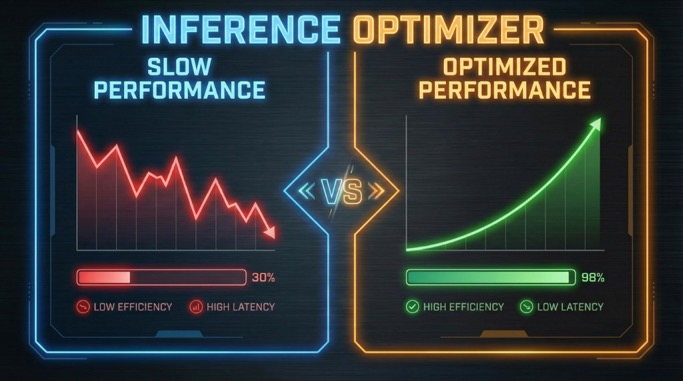

# inference-optimizer

**An OpenClaw skill that audits token usage, purges stale sessions, and optimizes inference speed.**

[](LICENSE)



Ask your bot to run a baseline audit, purge old session files, or get optimization recommendations. Instead of guessing where tokens go, you get workspace sizes, session counts, and actionable next steps.

```
> /preflight
> /optimize
> purge stale sessions
> audit workspace tokens
```

## Before installing

Use `/preflight` from chat to run install checks in one step. It creates timestamped backup archives, runs the audit, and runs setup preview.

If needed after review, run:

```bash
bash ~/clawd/skills/public/inference-optimizer/scripts/preflight.sh --apply-setup
```

Safety notes:

1. Do not run purge with `--delete` until you have inspected archive contents.
2. Do not grant broad exec allowlist or automated permission for `setup --apply` or `purge --delete`.
3. If agent-exec purge is needed, use path-specific approvals and monitor archive paths.

## Why

Every OpenClaw instance loads workspace files, session history, and tool schemas on every request. Stale sessions pile up. Daily memory stubs accumulate. The model gets slower and more expensive without obvious cause.

This skill fixes that. Run `/audit` for analyze-only output. Run `/optimize` for analyze + action flow. Approve a purge to clear stale sessions and stub files. No manual SSH, no guessing.

## Install

**ClawHub (recommended):**
```bash
clawhub install https://github.com/vitalyis/inference-optimizer
```

**Manual:**
```bash
git clone https://github.com/vitalyis/inference-optimizer.git ~/clawd/skills/public/inference-optimizer
bash ~/clawd/skills/public/inference-optimizer/scripts/setup.sh        # preview first
# Review output, then:
bash ~/clawd/skills/public/inference-optimizer/scripts/setup.sh --apply
```

## Setup

After install, run the setup script. By default it previews changes only; use `--apply` to modify workspace files:

```bash
bash ~/clawd/skills/public/inference-optimizer/scripts/setup.sh        # preview
bash ~/clawd/skills/public/inference-optimizer/scripts/setup.sh --apply  # apply
```

This makes scripts executable and, with `--apply`, appends command snippets to `AGENTS.md` and `TOOLS.md`.

## Commands

| Command | What it does |
|---------|--------------|
| `/preflight` | Chat install flow: backup + audit + setup preview (no setup apply unless `--apply-setup`) |
| `/audit` | Analyze only: run token audit (workspace files, sessions, config); no file-changing actions |
| `/optimize` | Analyze + action flow: run audit, then propose purge/optimization actions (approval required before running them) |
| purge sessions | After audit, if user approves, run purge script (default archive-first to `~/openclaw-purge-archive/<timestamp>/`; `--delete` for immediate removal without archive) |

## Verify

Confirm installation and script enablement:

```bash
bash ~/clawd/skills/public/inference-optimizer/scripts/verify.sh
```

Expected output:
- `optimization-agent.md` found
- `openclaw-audit.sh` executable
- `purge-stale-sessions.sh` executable
- Workspace paths resolvable
- AGENTS.md has `/optimize` (or manual step required)

## How It Works

```
SKILL.md (triggers + workflow)
    ↓
optimization-agent.md  ← agent reads for full Task 1–5 flow
scripts/
├── preflight.sh           ← backup + audit + setup preview
├── openclaw-audit.sh      ← baseline token audit
├── purge-stale-sessions.sh ← removes stale sessions + stub memory
├── setup.sh               ← wires commands into workspace
└── verify.sh              ← confirms install
    ↓
/preflight in chat → run install checks + backup + audit + setup preview
/audit in chat    → exec audit script → return output only
/optimize in chat → exec audit script → propose next actions
purge approved    → exec purge script → archives stale sessions/memory to ~/openclaw-purge-archive/<timestamp>/ by default
```

## Paths

Scripts auto-detect session and workspace paths:

- **Sessions:** `~/.openclaw/agents/main/sessions` or `~/.clawdbot/agents.main/sessions`
- **Workspace:** `~/clawd` or `~/.openclaw/workspace-whatsapp`
- **Memory:** `~/clawd/memory` or `~/.openclaw/workspace-whatsapp/memory`

## Script reference (for review)

- **openclaw-audit.sh:** Reads workspace file sizes, session counts, config size; outputs metadata only (no file contents). Lines 10–54.
- **preflight.sh:** Creates timestamped backup archives, runs audit, runs setup preview, writes logs, optional `--apply-setup`.
- **purge-stale-sessions.sh:** Archive vs delete logic; `--delete` flag. Archives to `~/openclaw-purge-archive/<timestamp>/` by default and prints summary counts for sessions/memory actions.
- **setup.sh:** Appends to AGENTS.md and TOOLS.md only when `--apply` is passed. Lines 52–74.

## Security

- **Audit** outputs only metadata (file sizes, token estimates); it does not echo config or workspace contents. Config and workspace paths may contain secrets; the audit reports character counts only.
- **Preflight** writes backup archives and logs under `~/openclaw-preflight-backup/<timestamp>/` by default.
- **Purge** moves stale session and memory files to a timestamped archive by default (`~/openclaw-purge-archive/<timestamp>/`). Verify archive contents before removing. Use `--delete` only when you want immediate deletion without archive.
- **Setup** modifies `AGENTS.md` and `TOOLS.md`. Run without `--apply` first to preview. Revert by removing the appended sections.
- **Allowlist:** Prefer running purge manually (`bash purge-stale-sessions.sh`) so no exec allowlist changes are needed. If purge must run via agent, add path-specific patterns rather than broad wildcards (`find *`, `rm **`).

## Limitations

- Run on the same host as OpenClaw (VPS or local)
- Workspace layout must match OpenClaw defaults

## License

MIT
